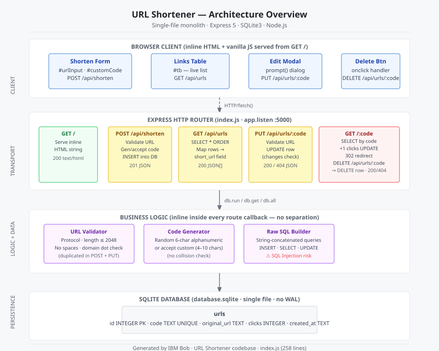

# URL Shortener

A lightweight, self-contained URL shortening service built with **Node.js**, **Express 5**, and **SQLite**. Paste any long URL and receive a short, shareable link that tracks every click. A built-in browser dashboard lets you create, browse, edit, and delete entries without touching the API directly.

---

## Table of Contents

1. [Architecture Overview](#architecture-overview)
2. [Prerequisites](#prerequisites)
3. [Quick Start](#quick-start)
4. [Interactive Web UI](#interactive-web-ui)
5. [API Documentation](#api-documentation)
   - [GET /](#get-)
   - [POST /api/shorten](#post-apishorten)
   - [GET /api/urls](#get-apiurls)
   - [GET /api/urls/:code](#get-apiurlscode)
   - [PUT /api/urls/:code](#put-apiurlscode)
   - [DELETE /api/urls/:code](#delete-apiurlscode)
   - [GET /:code](#get-code)
6. [Database Schema](#database-schema)
7. [Current Limitations & Technical Debt](#current-limitations--technical-debt)
8. [License](#license)

---

## Architecture Overview

The application is a **single-file monolith**. Every concern — HTTP routing, input validation, business logic, and database access — lives in [`index.js`](index.js).

```
Browser Client (inline HTML + vanilla JS)
        │  fetch() / form submit
        ▼
Express HTTP Server  :5000  (index.js)
  ├── GET  /                 → serves the entire browser UI as an HTML string
  ├── POST /api/shorten      → validate → generate/accept code → INSERT
  ├── GET  /api/urls         → SELECT * ORDER BY id DESC
  ├── GET  /api/urls/:code   → SELECT WHERE code = ?
  ├── PUT  /api/urls/:code   → validate → UPDATE WHERE code = ?
  ├── DELETE /api/urls/:code → DELETE WHERE code = ?
  └── GET  /:code            → SELECT → clicks+1 UPDATE → 302 redirect
        │  db.run / db.get / db.all
        ▼
SQLite  (database.sqlite)
  └── urls  (id · code · original_url · clicks · created_at)
```

A detailed visual version of the full request/response lifecycle is available at:

```
docs/architecture.svg
```

Open it in any browser or embed it in documentation with:

```html

```

---

## Prerequisites

| Requirement | Minimum version | Check |
|---|---|---|
| Node.js | 18.x | `node --version` |
| npm | 9.x | `npm --version` |

No external database server is required. SQLite runs in-process and stores data in a single file (`database.sqlite`) that is created automatically on first run.

---

## Quick Start

```bash
# 1. Clone the repository
git clone <repository-url>
cd url-shortener

# 2. Install dependencies
npm install

# 3. Start the server
node index.js
```

The server prints:

```
server running on port 5000
```

and is now reachable at **http://localhost:5000**.

> **Data persistence** — `database.sqlite` is created in the project root on first startup. Re-starting the server is safe; the `CREATE TABLE IF NOT EXISTS` guard means existing data is never dropped.

---

## Interactive Web UI

Open **http://localhost:5000** in a browser. The dashboard is served entirely from the `GET /` route — no separate build step or static file server is needed.

| UI element | What it does |
|---|---|
| **URL input** | Paste the long URL you want to shorten |
| **Custom code input** | Optionally supply a 4–10 character alias (leave blank for a random 6-character code) |
| **Shorten URL button** | Calls `POST /api/shorten` and reloads the links table |
| **All Links table** | Lists every saved entry with ID, code, original URL, short link, click count, and creation date |
| **Edit button** | Opens a prompt, then calls `PUT /api/urls/:code` to update the destination URL |
| **Delete button** | Confirms, then calls `DELETE /api/urls/:code` and removes the row from the table |

Clicking any short link in the table opens the destination in a new tab via the `GET /:code` redirect route.

---

## API Documentation

All API endpoints accept and return **JSON**. Error responses always use the shape `{ "err": "<reason>" }`.

### `GET /`

Serves the complete single-page browser UI as an HTML document.

| | |
|---|---|
| **Auth required** | No |
| **Request body** | None |

**Response — 200 OK**

```
Content-Type: text/html
```

Full HTML page containing inline CSS and vanilla JavaScript.

---

### `POST /api/shorten`

Creates a new short URL entry.

| | |
|---|---|
| **Auth required** | No |
| **Content-Type** | `application/json` |

**Request body**

| Field | Type | Required | Constraints |
|---|---|---|---|
| `url` | string | Yes | Must start with `http://` or `https://`, contain no spaces, include at least one `.`, and be ≤ 2 048 characters |
| `code` | string | No | 4–10 characters. Auto-generated (6-char alphanumeric) when omitted |

**Example request**

```bash
curl -X POST http://localhost:5000/api/shorten \
  -H "Content-Type: application/json" \
  -d '{"url": "https://www.example.com/some/very/long/path?query=1"}'
```

**Example request with a custom code**

```bash
curl -X POST http://localhost:5000/api/shorten \
  -H "Content-Type: application/json" \
  -d '{"url": "https://www.example.com", "code": "exmpl"}'
```

**Response — 201 Created**

```json
{
  "id":        1,
  "code":      "aB3xYz",
  "url":       "https://www.example.com/some/very/long/path?query=1",
  "short_url": "http://localhost:5000/aB3xYz",
  "clicks":    0
}
```

**Error responses**

| Status | `err` value | Cause |
|---|---|---|
| 400 | `missing body` | Request had no body |
| 400 | `url required` | `url` field absent from body |
| 400 | `url must be string` | `url` is not a string type |
| 400 | `url cannot be empty` | `url` is an empty string |
| 400 | `url too long` | `url` exceeds 2 048 characters |
| 400 | `invalid protocol, must be http or https` | URL does not start with `http://` or `https://` |
| 400 | `url cannot contain spaces` | URL contains one or more space characters |
| 400 | `invalid domain format` | URL contains no `.` character |
| 400 | `code too short` | Custom `code` is fewer than 4 characters |
| 400 | `code too long` | Custom `code` is more than 10 characters |

---

### `GET /api/urls`

Returns all stored short URL records, ordered newest-first.

| | |
|---|---|
| **Auth required** | No |
| **Request body** | None |

**Example request**

```bash
curl http://localhost:5000/api/urls
```

**Response — 200 OK**

```json
[
  {
    "id":           2,
    "code":         "exmpl",
    "original_url": "https://www.example.com",
    "short_url":    "http://localhost:5000/exmpl",
    "clicks":       7,
    "created_at":   "2024-06-01T12:00:00.000Z"
  },
  {
    "id":           1,
    "code":         "aB3xYz",
    "original_url": "https://www.example.com/some/very/long/path?query=1",
    "short_url":    "http://localhost:5000/aB3xYz",
    "clicks":       3,
    "created_at":   "2024-05-30T09:15:00.000Z"
  }
]
```

Returns `[]` when no records exist (never returns 404).

---

### `GET /api/urls/:code`

Fetches a single short URL record by its code. Does **not** redirect and does **not** increment the click counter.

| | |
|---|---|
| **Auth required** | No |
| **Request body** | None |
| **URL parameter** | `code` — the short code to look up |

**Example request**

```bash
curl http://localhost:5000/api/urls/exmpl
```

**Response — 200 OK**

```json
{
  "id":           2,
  "code":         "exmpl",
  "original_url": "https://www.example.com",
  "short_url":    "http://localhost:5000/exmpl",
  "clicks":       7,
  "created_at":   "2024-06-01T12:00:00.000Z"
}
```

**Error responses**

| Status | `err` value | Cause |
|---|---|---|
| 400 | `code required` | `:code` parameter is empty |
| 404 | `not found` | No record exists for the given code |

---

### `PUT /api/urls/:code`

Updates the destination URL for an existing short code. The code itself is immutable; only `original_url` is changed.

| | |
|---|---|
| **Auth required** | No |
| **Content-Type** | `application/json` |
| **URL parameter** | `code` — the short code to update |

**Request body**

| Field | Type | Required | Constraints |
|---|---|---|---|
| `url` | string | Yes | Same 8-step validation rules as `POST /api/shorten` |

**Example request**

```bash
curl -X PUT http://localhost:5000/api/urls/exmpl \
  -H "Content-Type: application/json" \
  -d '{"url": "https://www.example.com/new-destination"}'
```

**Response — 200 OK**

```json
{
  "msg":     "updated",
  "code":    "exmpl",
  "new_url": "https://www.example.com/new-destination"
}
```

**Error responses**

| Status | `err` value | Cause |
|---|---|---|
| 400 | `code required` | `:code` parameter is empty |
| 400 | *(same validation errors as POST)* | New URL fails any validation step |
| 404 | `not found` | No record exists for the given code |

---

### `DELETE /api/urls/:code`

Permanently removes a short URL entry.

| | |
|---|---|
| **Auth required** | No |
| **Request body** | None |
| **URL parameter** | `code` — the short code to delete (4–10 characters) |

**Example request**

```bash
curl -X DELETE http://localhost:5000/api/urls/exmpl
```

**Response — 200 OK**

```json
{
  "msg":  "deleted",
  "code": "exmpl"
}
```

**Error responses**

| Status | `err` value | Cause |
|---|---|---|
| 400 | `code required` | `:code` parameter is empty |
| 400 | `invalid code length` | Code is shorter than 4 or longer than 10 characters |
| 404 | `not found` | No record exists for the given code |

---

### `GET /:code`

Resolves a short code to its stored destination URL and issues an HTTP 302 redirect. Increments the click counter on every successful resolution.

| | |
|---|---|
| **Auth required** | No |
| **Request body** | None |
| **URL parameter** | `code` — the short code to resolve (4–10 characters) |

**Example request**

```bash
curl -v http://localhost:5000/aB3xYz
# → HTTP/1.1 302 Found
# → Location: https://www.example.com/some/very/long/path?query=1
```

**Response — 302 Found**

```
Location: <original_url>
```

**Error responses**

| Status | `err` value | Cause |
|---|---|---|
| 400 | `code length invalid` | Code is shorter than 4 or longer than 10 characters |
| 404 | `not found` | No record exists for the given code |
| 404 | `url empty` | Record exists but `original_url` is null or empty |

---

## Database Schema

The application creates and manages a single SQLite table at startup.

**File:** `database.sqlite` (created automatically in the project root)

```sql
CREATE TABLE IF NOT EXISTS urls (
  id           INTEGER PRIMARY KEY AUTOINCREMENT,
  code         TEXT    UNIQUE NOT NULL,
  original_url TEXT    NOT NULL,
  clicks       INTEGER DEFAULT 0,
  created_at   TEXT    NOT NULL
);
```

| Column | Type | Description |
|---|---|---|
| `id` | INTEGER | Auto-incrementing primary key |
| `code` | TEXT | Unique short alias (4–10 alphanumeric characters) |
| `original_url` | TEXT | Full destination URL |
| `clicks` | INTEGER | Number of times `GET /:code` successfully redirected |
| `created_at` | TEXT | ISO-8601 UTC timestamp set at insertion time |

> The database file is excluded from version control via `.gitignore`. Each deployment starts with a fresh, empty database.

---

## Current Limitations & Technical Debt

The following issues exist in the current implementation. They are documented here to guide future refactoring.

### 1. Monolithic single-file structure

All concerns (routing, validation, business logic, database access, and even the entire front-end HTML) live in a single 258-line [`index.js`](index.js). There is no separation into controllers, services, or a data-access layer. Any change to one concern risks breaking another, and the file will become increasingly difficult to navigate as features are added.

**Recommended fix:** Adopt an MVC structure — split the codebase into `routes/`, `controllers/`, `services/`, and `db/` directories with clearly bounded responsibilities.

---

### 2. Duplicated URL validation logic

The 8-step URL validation waterfall (protocol check, length check, space scan, domain-dot check) is copy-pasted verbatim into **both** `POST /api/shorten` (lines 176–251) and `PUT /api/urls/:code` (lines 509–562). Any bug fix or new rule must be applied in two places and will silently diverge over time.

**Recommended fix:** Extract a single `validateUrl(url)` function that both handlers call.

---

### 3. Raw string-concatenated SQL queries (SQL injection risk)

Every database query is assembled by string concatenation:

```js
// Example from GET /:code
var q = "SELECT * FROM urls WHERE code = '" + temp + "'";
```

A carefully crafted `code` value (e.g. `'; DROP TABLE urls; --`) could manipulate the query. All seven query sites in the file carry this risk.

**Recommended fix:** Use parameterised queries throughout:

```js
db.get("SELECT * FROM urls WHERE code = ?", [temp], function(err, row) { … });
```

---

### 4. No collision handling for auto-generated codes

When `POST /api/shorten` generates a random 6-character code, it performs no uniqueness check before the `INSERT`. If the randomly chosen code already exists, the SQLite `UNIQUE` constraint fires an error that is silently swallowed inside the `db.run` callback (the `err` argument is never inspected), leaving the client waiting for a response that never arrives.

**Recommended fix:** Check `err` in the INSERT callback and retry with a new code on a `SQLITE_CONSTRAINT` error, or pre-check uniqueness with a `SELECT` before inserting.

---

### 5. No test coverage

The `package.json` test script is a placeholder (`echo "Error: no test specified"`). There are zero unit tests, integration tests, or end-to-end tests. Refactoring any part of the code provides no safety net.

**Recommended fix:** Add a test framework (e.g. [Jest](https://jestjs.io/) or [Mocha](https://mochajs.org/) with [Supertest](https://github.com/ladjs/supertest)) and write tests covering at minimum: each validation rule, the code-generation path, and each HTTP status code path per route.

---

### 6. Hard-coded `localhost:5000` base URL

The `short_url` field returned by the API is always constructed as `http://localhost:5000/<code>`. This means the application cannot be deployed behind a domain or reverse proxy without a code change.

**Recommended fix:** Read the base URL from an environment variable:

```js
const BASE_URL = process.env.BASE_URL || 'http://localhost:5000';
```

---

### 7. No environment-based configuration

Port, database path, and base URL are all hard-coded constants. The application cannot be configured for different environments (development, staging, production) without modifying source files.

**Recommended fix:** Adopt a `.env` file with [dotenv](https://github.com/motdotla/dotenv) and document the available variables in this README.

---

### 8. No WAL mode or connection pooling for SQLite

The database is opened with default journal mode. Under concurrent load, writes will queue on a single connection and readers may be blocked. There is no graceful shutdown hook to close the database connection cleanly.

**Recommended fix:** Enable WAL mode (`PRAGMA journal_mode=WAL`) at startup for better read/write concurrency, and add a `process.on('SIGINT', ...)` handler to close the database before the process exits.

---

## License

ISC — see `package.json`.
